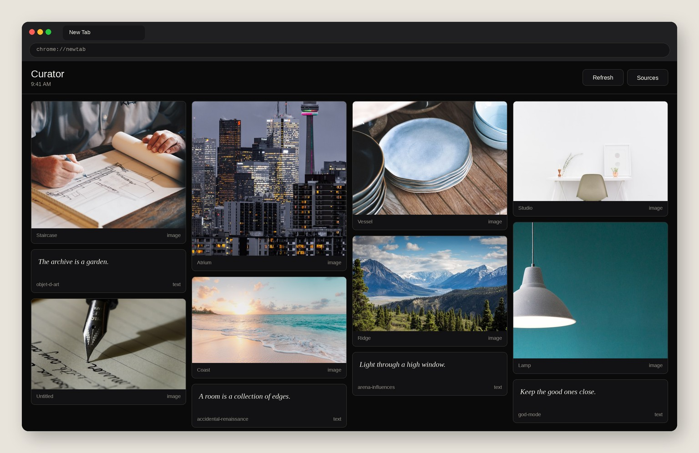

# Are.na New Tab Curator

Chrome extension (Manifest V3) that replaces the new tab page with a masonry of blocks from public Are.na channels.

Version **2.0.1**. Load unpacked. No account required for public channels.

*Sample first-run tab. Illustration only: architecture, objects, and landscape. No profiles, names, or private channels.*

## What you see

Install, then open a new tab. Chrome’s default page is gone. There is no sign-in wall, and nothing from your Google account, bookmarks, or history.

**Header**
- **Curator** and the current time on the left
- **Refresh** reloads the latest blocks
- **Sources** opens options (channel slugs and an optional token)

**Grid**
A four-column masonry of recent public blocks: images, text, and links. Each card has a title and a type (`image` / `text` / `link`). Your tab shows whatever is in the channels you pick, not the sample tiles above.

On first run it pulls these public channels (no token):

- `arena-influences`
- `accidental-renaissance`
- `objet-d-art`
- `god-mode`

**Viewer**
Click a card for a fullscreen view. Arrow keys move between blocks, Esc closes, **Open on Are.na** goes to the original block.

## What is new in 2.0

- Valid Manifest V3 JSON (1.0 could not load)
- `host_permissions` for the Are.na API (fixes blocked fetches)
- Public channel presets out of the box
- Images, text, and link blocks
- Fullscreen viewer with arrow keys
- Optional personal access token for private channels

## Install (unpacked)

1. Clone this repo, or unzip the [latest release](https://github.com/gundaIf/Are.na-New-Tab-Curator/releases/latest) archive
2. Chrome → `chrome://extensions` → Developer mode → **Load unpacked**
3. Select this folder
4. Open a new tab

Optional: extension **Details → Extension options**. One channel slug per line. Token from [are.na/settings/oauth](https://www.are.na/settings/oauth) only if you need private channels.

## Brave / Chrome footer

Chromium (Brave included) draws its own bar under any extension new tab: the extension name plus **Customise Brave** / **Customize Chrome**. That bar is not part of Curator.

Hide it:

1. Right-click the bar → **Hide footer on New Tab page**
2. Or open **Customise Brave** → turn off **Show footer on New Tab page**
3. Or `brave://flags` → search `NTP Footer` → Disabled → relaunch

## Notes

The token is stored in `chrome.storage.sync` and sent only to `api.are.na`.
